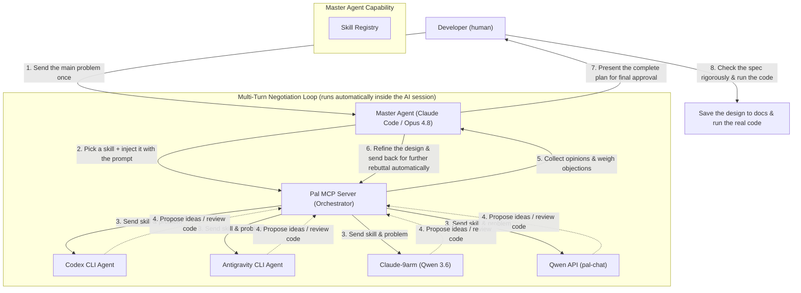

[🇹🇭 ภาษาไทย](./agentic-workflow-presentation.md) · **🇬🇧 English**

# Agentic Workflow Presentation

A document summarising the architecture and collaborative workflow of the AI agents the team built in-house — originally prepared to present to the project's academic advisor.

---

## 1. Problems with the conventional development process (Software DX Problems)

* **Redundancy and disorder**: Talking to an AI to get code with no up-front design step tends to produce inefficient code (AI Slop).
* **Model Bias**: Relying on a single vendor's model to design a complex system can steer the design in the wrong direction.
* **Single-shot Limitation**: Driving an agent with a single send-and-receive round tends to yield work that isn't detailed enough, lacking interactive review and correction.
* **Human-AI Communication Bottleneck**: If the main agent is forced to sit and brainstorm with the developer one question at a time, the developer has to watch the screen and type long answers — costing a great deal of time and human cognitive load.

---

## 2. The in-house agent architecture (Hybrid Multi-Agent Architecture)

To solve the above, our team built a skill named **`clink-brainstorm`** to create a **Multi-Turn Negotiation Loop**, together with a **Dynamic Skill Injection** system:

---

## 3. Comparison: AI-to-AI vs. AI-to-Developer Brainstorming

Brainstorming between AIs themselves (Agent-to-Agent) delivers superior performance to talking with a human (Agent-to-Human) on several fronts:

| Comparison point | Old way (AI talks to Developer) | New way (AIs brainstorm among themselves) |
|---|---|---|
| **Human time burden** | **Very high** (the developer must keep answering questions one by one) | **Very low** (the human sends the goal in the first round, then reviews the final summary) |
| **Rigour of the plan** | Medium (a human may overlook small technical points or edge cases) | **Very high** (4 agents scan the code and rebut each other's bugs thoroughly) |
| **Speed of drafting the plan** | Slow (bounded by a human's typing and analysis speed) | **Very fast** (agents converse over high-speed APIs in a few minutes) |

---

## 4. Cognitive Diversity of Agents

Bringing all 4 agents into a single session gives us 360-degree perspectives, because each has different strengths and behavioural traits:

* **Codex (Code-Centric)**: Directly checks the correctness and syntax of the code.
* **Antigravity (System-Centric)**: Analyses overall compatibility and deep file references within the directory.
* **Claude-9arm (Logic-Centric)**: Debates and analyses the logical soundness and efficiency of the program.
* **Qwen API (Conceptual-Centric)**: Proposes concepts, theories, and new ideas broadly.

---

## 5. Engineering Value

> [!IMPORTANT]
> **Multi-Turn Multi-Model Consensus through a single context**
> This system moves beyond using AI as a question-and-answer chatbot; it casts the AI in the role of an **"engineering design review board"** that negotiates and refines the design continuously until it reaches a maximally complete plan — much like the Architecture Review Board process of a large organisation.

> [!TIP]
> **Developer Cognitive Load Reduction**
> Moving the technical debate down to the AI-to-AI level cuts the time a developer must spend thinking step by step, making plans finish faster and noticeably more rigorous — with the developer serving only as the **"Final Approver."**

---

## 6. Delegating real work to agents (Work Delegation via `clink-subagents`)

If `clink-brainstorm` is the **design** phase (a committee debating until it has a plan), its companion skill **`clink-subagents`** is the **execution** phase: once the plan exists, the Master Agent **delegates well-scoped leaf tasks** to other agents to actually do via `clink`, then pulls the results back, verifies them, and stitches them together itself.

**Agent routing** is grounded in real [Artificial Analysis](https://artificialanalysis.ai/models) indices (Coding Index / Agentic Index), confirmed by a local benchmark:

| Agent | Model | Coding | Agentic | Best for |
|---|---|---|---|---|
| **Codex** | GPT-5.6 | **71–77** | **45–54** | Hard self-contained coding, in-place edits, code review — *elite model but weaker harness, so always verify* |
| **Antigravity** | Gemini 3.x | 68–70 | **21–37** ⚠️ | Only simple, single-shot, easily-verifiable tasks — *weak agentic, no multi-step work* |
| **Master (Claude)** | Opus 4.8 | ~74 | ~47 | Decompose + integrate + **verify everything a subagent returns** |

> [!IMPORTANT]
> **Delegate the leaves, own the tree**
> The Master keeps the hard agentic loop (plan, integrate, verify) and pushes verifiable "leaves" out — Codex for the hard leaf, Antigravity for the trivial one — gaining speed (parallel runs) and context savings without losing quality control, because **every subagent output is treated as unverified until the Master proves it.**
