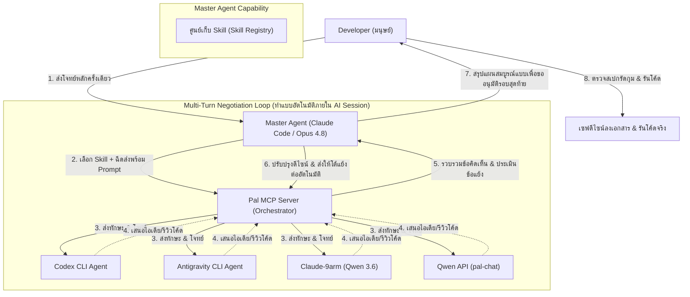

**🇹🇭 ภาษาไทย** · [🇬🇧 English](./agentic-workflow-presentation.en.md)

# สไลด์นำเสนอสถาปัตยกรรมกระบวนการพัฒนา (Agentic Workflow Presentation)

เอกสารสรุปสถาปัตยกรรมและกระบวนการทำงานร่วมกันของ AI เอเจนต์ที่ทีมพัฒนาสร้างขึ้นเอง สำหรับนำเสนออาจารย์ที่ปรึกษาโครงงาน

---

## 1. ปัญหาของกระบวนการพัฒนาทั่วไป (Software DX Problems)

* **ความซ้ำซ้อนและไร้ระเบียบ**: การคุยกับ AI เพื่อขอโค้ดโดยไม่มีขั้นตอนออกแบบล่วงหน้า มักนำไปสู่โค้ดที่ไม่ได้ประสิทธิภาพ (AI Slop)
* **ความเอนเอียงของคำตอบ (Model Bias)**: การอิงกับโมเดลเพียงค่ายเดียวสำหรับการออกแบบระบบซับซ้อน อาจทำให้ออกแบบผิดทิศทาง
* **ข้อจำกัดการถามตอบแบบรอบเดียว (Single-shot Limitation)**: การสั่งงานเอเจนต์แบบส่งไป-รับกลับรอบเดียว มักได้งานที่ไม่ละเอียดพอ ขาดการตรวจสอบและแก้ไขแบบโต้ตอบ
* **คอขวดเวลาการออกแบบระหว่างมนุษย์กับ AI (Human-AI Communication Bottleneck)**: หากบังคับให้เอเจนต์ตัวหลักต้องมานั่งคุยระดมสมองกับนักพัฒนา (Developer) ทีละคำถาม นักพัฒนาจะต้องคอยนั่งเฝ้าจอ พิมพ์ตอบขนาดยาว ซึ่งใช้เวลาและภาระทางสมองของมนุษย์สูงมาก

---

## 2. โครงสร้างระบบเอเจนต์ที่พัฒนาขึ้นเอง (Hybrid Multi-Agent Architecture)

เพื่อแก้ปัญหาข้างต้น ทีมเราได้พัฒนา Skill ชื่อ **`clink-brainstorm`** ขึ้นมา เพื่อสร้างกระบวนการ **Multi-Turn Negotiation Loop (วงจรการเจรจาต่อรองแบบหลายรอบ)** พร้อมระบบ **Dynamic Skill Injection (การฉีดทักษะแบบไดนามิก)**:

---

## 3. การเปรียบเทียบ: AI-to-AI vs. AI-to-Developer Brainstorming

ระบบการระดมสมองระหว่าง AI ด้วยกันเอง (Agent-to-Agent) มอบประสิทธิภาพที่เหนือกว่าแบบคุยกับมนุษย์ (Agent-to-Human) ในหลายด้าน:

| หัวข้อเปรียบเทียบ | แบบเดิม (AI คุยกับ Developer) | แบบใหม่ (AI คุยระดมสมองกันเอง) |
|---|---|---|
| **ภาระเวลาของมนุษย์** | **สูงมาก** (นักพัฒนาต้องคอยเฝ้าตอบคำถามทีละข้อ) | **ต่ำมาก** (มนุษย์ส่งเป้าหมายรอบแรก แล้วรอรีวิวผลสรุปรอบสุดท้าย) |
| **ความรัดกุมของแผนงาน** | ปานกลาง (มนุษย์อาจหลงลืมประเด็นทางเทคนิคเล็ก ๆ หรือ Edge Case) | **สูงมาก** (เอเจนต์ 4 ตัวสแกนโค้ดและค้านบั๊กกันเองอย่างถี่ถ้วน) |
| **ความเร็วในการร่างแผน** | ช้า (ขึ้นอยู่กับความเร็วในการพิมพ์และวิเคราะห์ของมนุษย์) | **เร็วมาก** (เอเจนต์คุยโต้ตอบผ่าน API ความเร็วสูงในเวลาไม่กี่นาที) |

---

## 4. ความหลากหลายทางมุมมองและพฤติกรรม (Cognitive Diversity of Agents)

การรวบรวมเอเจนต์ทั้ง 4 ตัวมาคุยกันใน Session เดียว ช่วยให้เราได้มุมมองที่แตกต่างรอบด้าน (360-degree perspectives) เนื่องจากแต่ละตัวมีจุดเด่นและลักษณะพฤติกรรมที่ต่างกัน:

* **Codex (Code-Centric)**: ตรวจทานความถูกต้องและรูปแบบไวยากรณ์ของโค้ดโดยตรง
* **Antigravity (System-Centric)**: วิเคราะห์ภาพรวมความเข้ากันได้และการอ้างอิงไฟล์ใน Directory เชิงลึก
* **Claude-9arm (Logic-Centric)**: ถกเถียงและวิเคราะห์ความสมเหตุสมผลเชิงตรรกะและประสิทธิภาพของโปรแกรม
* **Qwen API (Conceptual-Centric)**: เสนอแนวความคิด ทฤษฎี และไอเดียใหม่ ๆ แบบกว้างขวาง

---

## 5. ผลลัพธ์เชิงนวัตกรรม (Engineering Value)

> [!IMPORTANT]  
> **ฉันทามติหลายรอบผ่าน Context เดียว (Multi-Turn Multi-Model Consensus)**  
> ระบบนี้ก้าวข้ามการใช้ AI แบบแชตบอทถามคำตอบคำ แต่ทำให้ AI สวมบทบาทเป็น **"คณะกรรมการออกแบบระบบวิศวกรรม"** คุยเจรจาปรับปรุงดีไซน์ไปเรื่อย ๆ จนได้แบบแผนที่มีความสมบูรณ์สูงสุด คล้ายคลึงกับกระบวนการประชุมสถาปัตยกรรม (Architecture Review Board) ขององค์กรใหญ่

> [!TIP]  
> **การประหยัดกำลังสมองผู้พัฒนา (Developer Cognitive Load Reduction)**  
> การย้ายกระบวนการถกเถียงเชิงเทคนิคไปอยู่ในระดับ AI-to-AI ช่วยลดเวลาที่นักพัฒนาต้องมานั่งคิดทีละสเต็ป ทำให้แผนงานเสร็จเร็วขึ้นและรัดกุมขึ้นอย่างเห็นได้ชัด โดยนักพัฒนามีหน้าที่เป็นเพียง **"ผู้อนุมัติขั้นสุดท้าย (Final Approver)"** เท่านั้น
