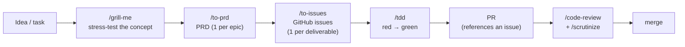
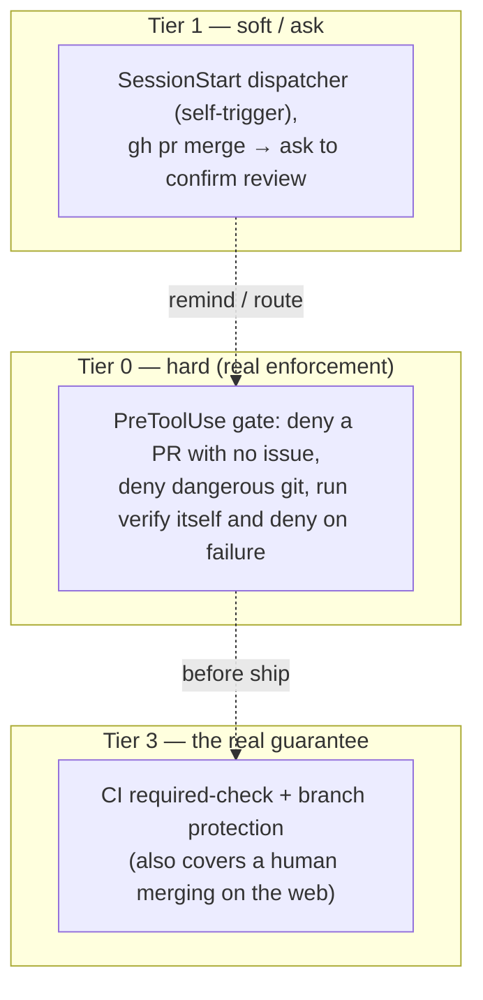

[🇹🇭 ภาษาไทย](./development-workflow.md) · **🇬🇧 English**

# T4 Development Workflow & Enforcement

A report-level summary of how work flows from an *idea* to *shipped code* in an **agent-primary** repo (the coding agent is the main developer), and what is **mechanically enforced** rather than left to the agent's discipline.

- Per-step operating detail → the `t4-dev-workflow` skill
- The enforcement design rationale (alternatives rejected, the honest ceiling) → [ADR 0001](./adr/0001-hook-based-workflow-enforcement.md)
- Hook install / troubleshooting → `skills/t4/t4-project-bootstrap/references/hooks-layer.md`

---

## 1. The problem

Agents in an agent-primary repo fail two ways: **(1)** they don't invoke the skill they should, and **(2)** they invoke it but **drift off the workflow** mid-task. The steps used to rely on the model *noticing* the condition — which leaks. The goal is to make the right step **happen reliably and be hard to skip**.

---

## 2. Pipeline — idea to merge

**Hard gate: PRD → issues → PR** — never open a PR without a referenced issue; a PRD becomes issues before code, and code maps to an issue before a PR.

---

## 3. The enforcement ladder

The crux: **the agent both does the work and authors any "receipt" that a step ran**, so agent-produced evidence is forgeable. A machine can only enforce what it can **verify independently** — hence the layers.

| Tier | Mechanism | How strong |
|---|---|---|
| **0 hard** | `PreToolUse` gate — PR-needs-issue, dangerous git, **verify the hook runs itself** | Real (un-forgeable — the hook runs the tests) |
| **1 soft** | dispatcher injected at SessionStart (route-first + red-flags), `gh pr merge` → `ask` (skipped by an `autoMerge`/`afk` marker for AFK runs) | Raises the odds of compliance; the model can still skip |
| **3 real** | CI required-check + branch protection | Top guarantee — outside the agent, covers human web-merges |

---

## 4. Enforced vs. discipline

| Machine-enforced (checkable) | Left to agent discipline (uncheckable) |
|---|---|
| A PR must reference an issue | The *depth* of a code-review / scrutinize |
| Dangerous git (`reset --hard`, force-push, `clean -f`, `branch -D`) | TDD discipline (was the test really written first) |
| A green verify before `gh pr merge` (fast suite; e2e in CI) | `/simplify`, `/debug-mantra` (judgment calls) |

**The honest ceiling:** hooks enforce *checkable actions*, not *process discipline* — claiming a hook "enforces TDD" by checking a test file exists is **theater**. What can't be enforced leans on the **soft dispatcher** (raising the trigger rate) plus human review / CI.

---

## 5. Two delivery paths

- **B (native):** the repo is a Claude Code plugin (`.claude-plugin/` + `hooks/`) — installing it registers the hooks.
- **A (universal):** `t4-project-bootstrap` writes the same hooks into each repo's committed `.claude/` — they travel via git without the plugin.
- Both share a per-session lock to avoid double-injection; a byte-sync test keeps the two script copies identical.
