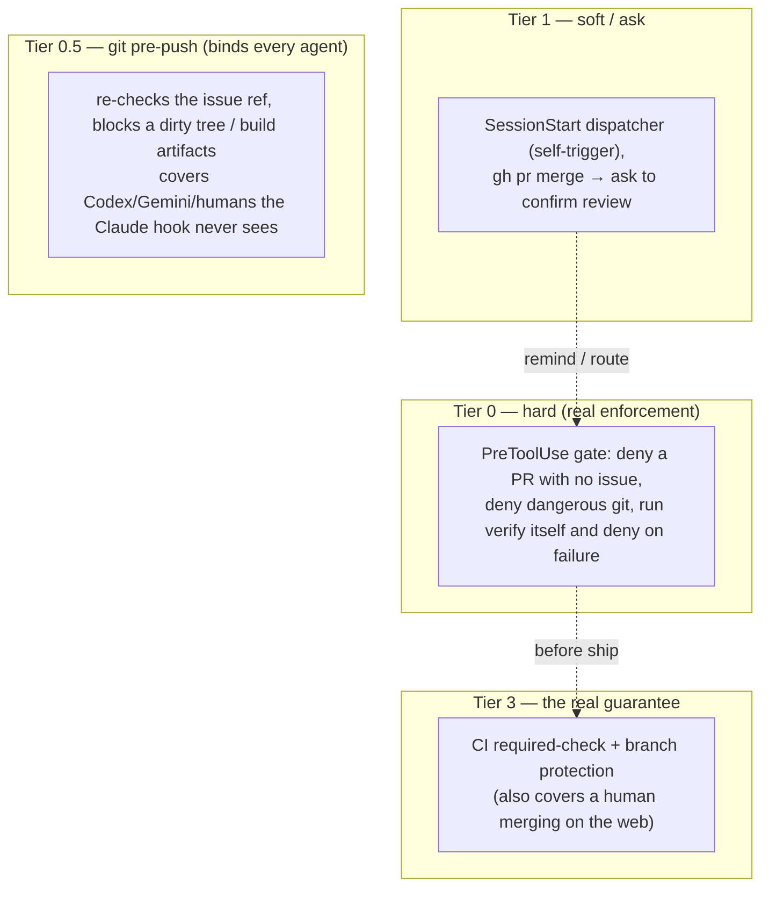

[🇹🇭 ภาษาไทย](./development-workflow.md) · **🇬🇧 English**

# T4 Development Workflow & Enforcement

A report-level summary of how work flows from an *idea* to *shipped code* in an **agent-primary** repo (the coding agent is the main developer), and what is **mechanically enforced** rather than left to the agent's discipline.

- Per-step operating detail → the `t4-dev-workflow` skill
- The enforcement design rationale (alternatives rejected, the honest ceiling) → [ADR 0001](./adr/0001-hook-based-workflow-enforcement.md)
- Hook install / troubleshooting → `skills/t4/t4-project-bootstrap/references/hooks-layer.md`

---

## 1. The problem

Agents in an agent-primary repo fail two ways: **(1)** they don't invoke the skill they should, and **(2)** they invoke it but **drift off the workflow** mid-task. The steps used to rely on the model *noticing* the condition — which leaks. The goal is to make the right step **happen reliably and be hard to skip**.

---

## 2. Pipeline — idea to merge

```mermaid
graph LR
    Idea["Idea / task"] --> Grill["/grill-me<br/>stress-test the concept"]
    Grill --> GrillDocs["/grill-with-docs<br/>challenge vs ADRs"]
    GrillDocs --> Survey["survey the change sites<br/>change inventory"]
    Survey --> PRD["/to-prd<br/>PRD (1 per epic)"]
    PRD --> Issues["/to-issues<br/>GitHub issues<br/>(1 per deliverable)"]
    Issues --> TDD["/tdd<br/>red → green"]
    TDD --> PR["PR<br/>(references an issue)"]
    PR --> Review["/code-review<br/>+ /scrutinize"]
    Review --> Merge["merge"]
```

**Hard gate: PRD → issues → PR** — never open a PR without a referenced issue; a PRD becomes issues before code, and code maps to an issue before a PR.

---

## 3. The enforcement ladder

The crux: **the agent both does the work and authors any "receipt" that a step ran**, so agent-produced evidence is forgeable. A machine can only enforce what it can **verify independently** — hence the layers.

```mermaid
graph TD
    subgraph T0["Tier 0 — hard (real enforcement)"]
      A["PreToolUse gate: deny a PR with no issue,<br/>deny dangerous git, run verify itself and deny on failure"]
    end
    subgraph T1["Tier 1 — soft / ask"]
      B["SessionStart dispatcher (self-trigger),<br/>gh pr merge → ask to confirm review"]
    end
    subgraph T05["Tier 0.5 — git pre-push (binds every agent)"]
      G["re-checks the issue ref, blocks a dirty tree / build artifacts<br/>covers Codex/Gemini/humans the Claude hook never sees"]
    end
    subgraph T3["Tier 3 — the real guarantee"]
      C["CI required-check + branch protection<br/>(also covers a human merging on the web)"]
    end
    B -.->|remind / route| A
    A -.->|before ship| C
```

| Tier | Mechanism | How strong |
|---|---|---|
| **0 hard** | `PreToolUse` gate — PR-needs-issue, dangerous git, **verify the hook runs itself** | Real (un-forgeable — the hook runs the tests) |
| **1 soft** | dispatcher injected at SessionStart (route-first + red-flags), `gh pr merge` → `ask` (skipped by an `autoMerge`/`afk` marker for AFK runs) | Raises the odds of compliance; the model can still skip |
| **0.5 hard (agent-agnostic)** | git `pre-push` — issue ref from branch/commit/PR body, blocks an over-budget dirty tree and build artifacts | Binds **every** agent + human on the clone (`PreToolUse` only sees tool calls Claude makes — Bash and the GitHub MCP tools); opt-in per clone and `--no-verify`-able |
| **3 real** | CI required-check + branch protection | Top guarantee — outside the agent, covers human web-merges |

**What Tier 3 consists of** (installed by `t4-project-bootstrap` → `references/ci-cd-layer.md`):

| Part | File | Role |
|---|---|---|
| Quality gate | `.github/workflows/t4-verify.yml` | Split into 4 jobs — `lint` · `typecheck` · `test` · `build` — each a **required check** on `main`, so the check name alone says what broke |
| Slow suite | `t4-e2e.yml` | e2e/browser, kept out of the local `verify` (issue #13). Start advisory, promote to required once stable |
| CD | `t4-deploy.yml` | Deploys only after `T4 verify` is green on `main` (`workflow_run`, not `push`), checks out the passing `head_sha`, uses a GitHub Environment as the human approval gate |
| Branch ruleset | `gh api ... /rulesets` | No direct pushes to `main`, no force-push/deletion, branch must be up to date before merge (`strict`), review threads must be resolved |

**The limit, stated plainly:** a private repo on the free plan can't enforce rulesets → use `.claude/t4.json` `"requireGreenCI": true` instead, which makes the hook run `gh pr checks` before merge and deny on a failing or pending check — **weaker than a ruleset**, since it only binds commands the agent runs through the hook; a human merging on the web still slips past.

---

## 4. Enforced vs. discipline

| Machine-enforced (checkable) | Left to agent discipline (uncheckable) |
|---|---|
| A PR must reference an issue | The *depth* of a code-review / scrutinize |
| Dangerous git (`reset --hard`, force-push, `clean -f`, `branch -D`) | TDD discipline (was the test really written first) |
| A green verify before `gh pr merge` (fast suite; e2e in CI) | `/simplify`, `/debug-mantra` (judgment calls) |

**The honest ceiling:** hooks enforce *checkable actions*, not *process discipline* — claiming a hook "enforces TDD" by checking a test file exists is **theater**. What can't be enforced leans on the **soft dispatcher** (raising the trigger rate) plus human review / CI.

---

## 5. Two delivery paths

- **B (native):** the repo is a Claude Code plugin (`.claude-plugin/` + `hooks/`) — installing it registers the hooks.
- **A (universal):** `t4-project-bootstrap` writes the same hooks into each repo's committed `.claude/` — they travel via git without the plugin.
- Both share a per-session lock to avoid double-injection; a byte-sync test keeps the two script copies identical.

---

## 6. Paired repository — `xenodeve/pal-mcp-server`

This repo is the **agent-enforcement layer**: the skills that decide how a master agent behaves. [`xenodeve/pal-mcp-server`](https://github.com/xenodeve/pal-mcp-server) is the **tools layer**: the `clink` bridge those skills drive. Most `clink` work has a counterpart there, and **a change to one side is usually incomplete on its own**.

| here (agent — how a master *must behave*) | pal-mcp-server (tools — what `clink` *can do*) |
|---|---|
| **#71** enforcement layer for supervised delegation | **#11** supervised subagent sessions (epic; phases #12–#16) |
| **#74** master-agent pre-delegation checklist — acceptance, feasibility, containment, failure semantics, verification | **#20** subagent lifetime — no fixed deadline, process-tree ownership, cancel/reap |
| **#73** route on measured cost — refresh the figures, name every scale, contract-test them | **#21** report the cost of every call — usage, resolved model/effort, credits |
| **#72** research: the capability matrix that sources #73's figures | — |

**The rule: when you change one side, check the other in the same session.** Specifically —

- **A tool capability lands there** → the skill that told agents to compensate for its absence is now wrong. `#74` labels every checklist item `discipline` or `tool` **and names the issue** that delivers it, so the items to revisit are mechanically findable.
- **A figure changes there** (a price, a rate card, a default model/effort) → skill figures sourced from it go stale. `#73` adds a contract test so this breaks a test rather than silently misleading an agent.
- **A skill starts requiring something the tool cannot do** → that is a tool gap; file it in pal-mcp-server.

Four requirements currently belong to **no issue in either repository**: argument allowlisting, defences against prompt injection carried in repository content, resource admission, and conflict-aware promotion. They are recorded in `#74`.

> Tracker asymmetry: pal-mcp-server carries the T4 triage labels (`ready-for-agent`, `clink`, `Feature`, `security`, …); this repo currently has only GitHub's defaults, so its issues are unlabelled. Don't read the missing labels as missing triage — `t4-project-bootstrap` is what closes that gap.

---

## 7. Convening a panel — `clink-brainstorm` needs no permission

**Standing authorization: invoke `clink-brainstorm` whenever you judge it useful. Don't ask first.** It is the one discipline you may spend freely, because the cases it covers are the ones where being wrong is expensive and being slow is not.

Reach for it when:

- **The plan is complex** — several interacting parts, or an approach you cannot fully specify yet.
- **The decision is hard to reverse** — an architectural seam, a schema, a public interface, a dependency adoption, anything heading for an ADR. If `t4-engineering-records` would want an ADR for it, that is a reason to convene a panel *before* deciding, not after.
- **The stakes are high** — a trust boundary, a change landing across many call sites, a migration.
- **You are confident and alone.** A single agent's confident answer is the failure mode a panel exists to catch — measured in our own research, one seat got 9 of 10 absence claims wrong while formatting them authoritatively, and only disagreement with the other seats surfaced it.

**What it is, and is not.** `clink-brainstorm` convenes several independent agents on the *same* question and returns **judgment** — what is wrong, what to build, which approach wins. `clink-subagents` returns **finished work**. They are not variants of each other and must not share model or effort settings; a panel's deliverable is reasoning, so it takes the reasoning model, never the small one.

**Cognitive diversity is the product.** Three calls to the same backend is one opinion with error bars. Spread the seats across model families, and prefer each client's house quota lane so a round is cheap.

**It is not free, and that is not a reason to skip it.** A round is several agents and minutes of wall-clock. Weigh it against the cost of the *decision*, not the cost of a single call — overkill for a reversible one-liner, cheap for a seam you will live with.

**Synthesize, don't paste.** The answers are input to your judgment, not a vote to average. State where the seats converged, where they split, and which side you think is right — you hold the session context they do not. Then verify: convergence is evidence, not proof.
