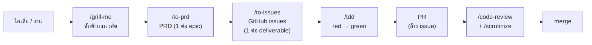
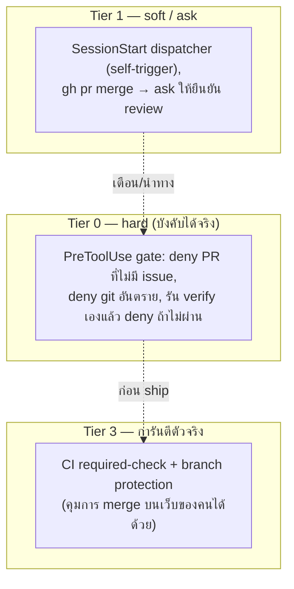

**🇹🇭 ภาษาไทย** · [🇬🇧 English](./development-workflow.en.md)

# กระบวนการพัฒนาและการบังคับใช้ (T4 Development Workflow & Enforcement)

เอกสารระดับรายงานที่สรุปว่างานไหลจาก *ไอเดีย* ไปสู่ *โค้ดที่ ship แล้ว* อย่างไรในรีโปแบบ **agent-primary** (coding agent เป็น developer หลัก) และมีอะไรที่ถูก **บังคับด้วยเครื่องจักร** ไม่ใช่แค่พึ่งวินัยของ agent

- รายละเอียดเชิงปฏิบัติของแต่ละขั้น → skill `t4-dev-workflow`
- เหตุผลการออกแบบการบังคับใช้ (ทางเลือกที่ตัดทิ้ง, เพดานความจริง) → [ADR 0001](./adr/0001-hook-based-workflow-enforcement.md)
- วิธีติดตั้ง/แก้ปัญหา hook → `skills/t4/t4-project-bootstrap/references/hooks-layer.md`

---

## 1. ปัญหาที่แก้

Agent ในรีโปแบบ agent-primary พังได้สองแบบ: **(1)** ไม่เรียก skill ที่ควรใช้เลย และ **(2)** เรียกแล้วแต่ **หลุดออกจาก workflow** กลางทาง เดิมทีขั้นตอนต่าง ๆ พึ่ง "ให้ model สังเกตเอง" ซึ่งรั่ว เป้าหมายคือทำให้ขั้นตอนที่ถูกต้อง **เกิดขึ้นอย่างเชื่อถือได้และข้ามได้ยาก**

---

## 2. Pipeline — จากไอเดียสู่ merge

**Hard gate: PRD → issues → PR** — ไม่เปิด PR โดยไม่มี issue อ้างอิง; PRD กลายเป็น issues ก่อนเขียนโค้ด, โค้ดผูกกับ issue ก่อนเปิด PR

---

## 3. บันไดการบังคับใช้ (Enforcement Ladder)

หัวใจสำคัญ: **agent เป็นทั้งคนทำงานและคนเขียน "หลักฐาน" ว่าทำแล้ว** ดังนั้นหลักฐานที่ agent สร้างเองปลอมได้ เครื่องจักรบังคับได้เฉพาะสิ่งที่ **ตรวจสอบเองได้อิสระ** — นี่คือที่มาของการแบ่งเป็นชั้น

| Tier | กลไก | บังคับได้แค่ไหน |
|---|---|---|
| **0 hard** | `PreToolUse` gate — PR-ต้องมี-issue, git อันตราย, **verify ที่ hook รันเอง** | บังคับจริง (ปลอมไม่ได้เพราะ hook รันเทสต์เอง) |
| **1 soft** | dispatcher ที่ inject ตอน SessionStart (route-first + red-flags), `gh pr merge` → `ask` (ข้ามด้วย marker `autoMerge`/`afk` ตอน AFK) | ยกโอกาสทำตามให้สูงขึ้น แต่ model ยังข้ามได้ |
| **3 real** | CI required-check + branch protection | การันตีสูงสุด — อยู่นอกมือ agent, คุมคน merge บนเว็บได้ |

---

## 4. อะไรถูกบังคับ vs. อะไรเป็นวินัย

| บังคับด้วยเครื่องจักร (ตรวจได้) | เหลือเป็นวินัย agent (ตรวจไม่ได้) |
|---|---|
| PR ต้องมี issue อ้างอิง | *คุณภาพ* ของ code-review / scrutinize |
| git อันตราย (`reset --hard`, force-push, `clean -f`, `branch -D`) | วินัย TDD (เขียน test ก่อนจริงไหม) |
| verify ต้องเขียวก่อน `gh pr merge` (ชุดเร็ว; e2e ที่ CI) | `/simplify`, `/debug-mantra` (เป็นดุลพินิจ) |

**เพดานความจริง:** hook บังคับได้แค่ *action ที่ตรวจได้* ไม่ใช่ *วินัยของกระบวนการ* — การเคลมว่า "hook บังคับ TDD ได้" โดยแค่เช็คว่ามีไฟล์ test = **theater** ส่วนที่บังคับไม่ได้จะพึ่ง **soft dispatcher** (ยก trigger rate) + คนรีวิว/CI

---

## 5. สองเส้นทางส่งมอบ (Delivery)

- **B (native):** รีโปเป็น Claude Code plugin (`.claude-plugin/` + `hooks/`) — install แล้ว hook ลงทะเบียนเอง
- **A (universal):** `t4-project-bootstrap` เขียน hook ชุดเดียวกันลง `.claude/` ที่ commit ติดรีโป — พกไปเองผ่าน git แม้ไม่มี plugin
- ทั้งสองใช้ล็อกต่อ session ร่วมกันกัน inject ซ้ำ; เทสต์ byte-sync คุมให้สคริปต์สองชุดเหมือนกันเป๊ะ
