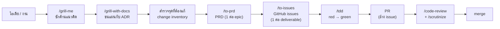
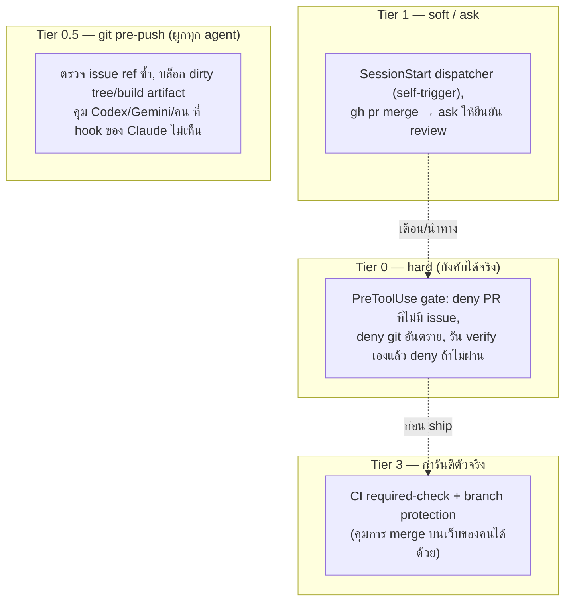

**🇹🇭 ภาษาไทย** · [🇬🇧 English](./development-workflow.en.md)

# กระบวนการพัฒนาและการบังคับใช้ (T4 Development Workflow & Enforcement)

เอกสารระดับรายงานที่สรุปว่างานไหลจาก *ไอเดีย* ไปสู่ *โค้ดที่ ship แล้ว* อย่างไรในรีโปแบบ **agent-primary** (coding agent เป็น developer หลัก) และมีอะไรที่ถูก **บังคับด้วยเครื่องจักร** ไม่ใช่แค่พึ่งวินัยของ agent

- รายละเอียดเชิงปฏิบัติของแต่ละขั้น → skill `t4-dev-workflow`
- เหตุผลการออกแบบการบังคับใช้ (ทางเลือกที่ตัดทิ้ง, เพดานความจริง) → [ADR 0001](./adr/0001-hook-based-workflow-enforcement.md)
- วิธีติดตั้ง/แก้ปัญหา hook → `skills/t4/t4-project-bootstrap/references/hooks-layer.md`

---

## 1. ปัญหาที่แก้

Agent ในรีโปแบบ agent-primary พังได้สองแบบ: **(1)** ไม่เรียก skill ที่ควรใช้เลย และ **(2)** เรียกแล้วแต่ **หลุดออกจาก workflow** กลางทาง เดิมทีขั้นตอนต่าง ๆ พึ่ง "ให้ model สังเกตเอง" ซึ่งรั่ว เป้าหมายคือทำให้ขั้นตอนที่ถูกต้อง **เกิดขึ้นอย่างเชื่อถือได้และข้ามได้ยาก**

---

## 2. Pipeline — จากไอเดียสู่ merge

```mermaid
graph LR
    Idea["ไอเดีย / งาน"] --> Grill["/grill-me<br/>ซักค้านแนวคิด"]
    Grill --> GrillDocs["/grill-with-docs<br/>ชนแผนกับ ADR"]
    GrillDocs --> Survey["สำรวจจุดที่ต้องแก้<br/>change inventory"]
    Survey --> PRD["/to-prd<br/>PRD (1 ต่อ epic)"]
    PRD --> Issues["/to-issues<br/>GitHub issues<br/>(1 ต่อ deliverable)"]
    Issues --> TDD["/tdd<br/>red → green"]
    TDD --> PR["PR<br/>(อ้าง issue)"]
    PR --> Review["/code-review<br/>+ /scrutinize"]
    Review --> Merge["merge"]
```

**Hard gate: PRD → issues → PR** — ไม่เปิด PR โดยไม่มี issue อ้างอิง; PRD กลายเป็น issues ก่อนเขียนโค้ด, โค้ดผูกกับ issue ก่อนเปิด PR

---

## 3. บันไดการบังคับใช้ (Enforcement Ladder)

หัวใจสำคัญ: **agent เป็นทั้งคนทำงานและคนเขียน "หลักฐาน" ว่าทำแล้ว** ดังนั้นหลักฐานที่ agent สร้างเองปลอมได้ เครื่องจักรบังคับได้เฉพาะสิ่งที่ **ตรวจสอบเองได้อิสระ** — นี่คือที่มาของการแบ่งเป็นชั้น

```mermaid
graph TD
    subgraph T0["Tier 0 — hard (บังคับได้จริง)"]
      A["PreToolUse gate: deny PR ที่ไม่มี issue,<br/>deny git อันตราย, รัน verify เองแล้ว deny ถ้าไม่ผ่าน"]
    end
    subgraph T1["Tier 1 — soft / ask"]
      B["SessionStart dispatcher (self-trigger),<br/>gh pr merge → ask ให้ยืนยัน review"]
    end
    subgraph T05["Tier 0.5 — git pre-push (ผูกทุก agent)"]
      G["ตรวจ issue ref ซ้ำ, บล็อก dirty tree/build artifact<br/>คุม Codex/Gemini/คน ที่ hook ของ Claude ไม่เห็น"]
    end
    subgraph T3["Tier 3 — การันตีตัวจริง"]
      C["CI required-check + branch protection<br/>(คุมการ merge บนเว็บของคนได้ด้วย)"]
    end
    B -.->|เตือน/นำทาง| A
    A -.->|ก่อน ship| C
```

| Tier | กลไก | บังคับได้แค่ไหน |
|---|---|---|
| **0 hard** | `PreToolUse` gate — PR-ต้องมี-issue, git อันตราย, **verify ที่ hook รันเอง** | บังคับจริง (ปลอมไม่ได้เพราะ hook รันเทสต์เอง) |
| **1 soft** | dispatcher ที่ inject ตอน SessionStart (route-first + red-flags), `gh pr merge` → `ask` (ข้ามด้วย marker `autoMerge`/`afk` ตอน AFK) | ยกโอกาสทำตามให้สูงขึ้น แต่ model ยังข้ามได้ |
| **0.5 hard (agent-agnostic)** | git `pre-push` — ตรวจ issue ref จาก branch/commit/PR body, บล็อก tree ที่สกปรกเกินงบและ build artifact | คุม **ทุก** agent + คนบน clone นั้น (`PreToolUse` เห็นแค่คำสั่งที่ Claude รัน) แต่ opt-in ต่อ clone และ `--no-verify` ได้ |
| **3 real** | CI required-check + branch protection | การันตีสูงสุด — อยู่นอกมือ agent, คุมคน merge บนเว็บได้ |

**Tier 3 ประกอบด้วยอะไรบ้าง** (ติดตั้งโดย `t4-project-bootstrap` → `references/ci-cd-layer.md`):

| ส่วน | ไฟล์ | บทบาท |
|---|---|---|
| Quality gate | `.github/workflows/t4-verify.yml` | แยกเป็น 4 job — `lint` · `typecheck` · `test` · `build` — ทุกตัวเป็น **required check** บน `main` ชื่อ check บอกได้ทันทีว่าอะไรพัง |
| Slow suite | `t4-e2e.yml` | e2e/browser แยกออกจาก `verify` ในเครื่อง (issue #13) เริ่มแบบ advisory แล้วค่อยเลื่อนเป็น required เมื่อนิ่ง |
| CD | `t4-deploy.yml` | deploy หลัง `T4 verify` เขียวบน `main` เท่านั้น (`workflow_run` ไม่ใช่ `push`), checkout `head_sha` ที่ผ่าน, ใช้ GitHub Environment เป็นด่านอนุมัติของคน |
| Branch ruleset | `gh api ... /rulesets` | ห้าม push ตรงเข้า `main`, ห้าม force-push/ลบ branch, ต้อง branch อัปเดตก่อน merge (`strict`), review thread ต้องถูก resolve |

**ข้อจำกัดที่ต้องพูดตรง ๆ:** รีโป private บนแพลนฟรีบังคับ ruleset ไม่ได้ → ใช้ `.claude/t4.json` `"requireGreenCI": true` แทน ซึ่งทำให้ hook รัน `gh pr checks` ก่อน merge แล้ว deny ถ้ามี check แดงหรือค้าง — **อ่อนกว่า ruleset** เพราะคุมได้แค่คำสั่งที่ agent รันผ่าน hook คน merge บนเว็บยังรอด

---

## 4. อะไรถูกบังคับ vs. อะไรเป็นวินัย

| บังคับด้วยเครื่องจักร (ตรวจได้) | เหลือเป็นวินัย agent (ตรวจไม่ได้) |
|---|---|
| PR ต้องมี issue อ้างอิง | *คุณภาพ* ของ code-review / scrutinize |
| git อันตราย (`reset --hard`, force-push, `clean -f`, `branch -D`) | วินัย TDD (เขียน test ก่อนจริงไหม) |
| verify ต้องเขียวก่อน `gh pr merge` (ชุดเร็ว; e2e ที่ CI) | `/simplify`, `/debug-mantra` (เป็นดุลพินิจ) |

**เพดานความจริง:** hook บังคับได้แค่ *action ที่ตรวจได้* ไม่ใช่ *วินัยของกระบวนการ* — การเคลมว่า "hook บังคับ TDD ได้" โดยแค่เช็คว่ามีไฟล์ test = **theater** ส่วนที่บังคับไม่ได้จะพึ่ง **soft dispatcher** (ยก trigger rate) + คนรีวิว/CI

---

## 5. สองเส้นทางส่งมอบ (Delivery)

- **B (native):** รีโปเป็น Claude Code plugin (`.claude-plugin/` + `hooks/`) — install แล้ว hook ลงทะเบียนเอง
- **A (universal):** `t4-project-bootstrap` เขียน hook ชุดเดียวกันลง `.claude/` ที่ commit ติดรีโป — พกไปเองผ่าน git แม้ไม่มี plugin
- ทั้งสองใช้ล็อกต่อ session ร่วมกันกัน inject ซ้ำ; เทสต์ byte-sync คุมให้สคริปต์สองชุดเหมือนกันเป๊ะ

---

## 6. รีโปคู่ — `xenodeve/pal-mcp-server`

รีโปนี้คือ **ชั้นบังคับ agent**: skill ที่ตัดสินว่า master agent ต้องทำตัวอย่างไร ส่วน [`xenodeve/pal-mcp-server`](https://github.com/xenodeve/pal-mcp-server) คือ **ชั้นเครื่องมือ**: ตัวเชื่อม `clink` ที่ skill เหล่านั้นขับ งาน `clink` ส่วนใหญ่มีคู่ของมันอยู่ที่นั่น และ **การแก้ฝั่งเดียวมักไม่สมบูรณ์ในตัวเอง**

| ที่นี่ (agent — master *ต้องทำตัวอย่างไร*) | pal-mcp-server (tools — `clink` *ทำอะไรได้*) |
|---|---|
| **#71** enforcement layer สำหรับการส่งงานแบบมีผู้ควบคุม | **#11** supervised subagent sessions (epic; phase #12–#16) |
| **#74** เช็คลิสต์ก่อนส่งงานของ master agent — การยอมรับ, ความเป็นไปได้, การจำกัดขอบเขต, ความหมายของความล้มเหลว, การตรวจสอบ | **#20** อายุของ subagent — ไม่มี deadline ตายตัว, เป็นเจ้าของ process tree, ยกเลิก/เก็บกวาด |
| **#73** route ด้วยต้นทุนที่วัดได้ — ปรับตัวเลข, ระบุชื่อทุกสเกล, คุมด้วย contract test | **#21** รายงานต้นทุนของทุกการเรียก — usage, model/effort ที่ resolve แล้ว, credits |
| **#72** research: capability matrix ที่เป็นแหล่งตัวเลขของ #73 | — |

**กฎ: เมื่อแก้ฝั่งหนึ่ง ให้ตรวจอีกฝั่งในเซสชันเดียวกัน** โดยเฉพาะ —

- **ความสามารถของเครื่องมือลงที่นั่น** → skill ที่เคยบอก agent ให้ชดเชยการไม่มีของมันจะผิดทันที `#74` ติดป้ายทุกข้อในเช็คลิสต์ว่า `discipline` หรือ `tool` **พร้อมระบุ issue** ที่ส่งมอบมัน ข้อที่ต้องกลับมาแก้จึงหาได้เชิงกลไก
- **ตัวเลขเปลี่ยนที่นั่น** (ราคา, rate card, model/effort เริ่มต้น) → ตัวเลขใน skill ที่อ้างอิงมันจะเก่า `#73` เพิ่ม contract test เพื่อให้เรื่องนี้ทำให้เทสต์แตก แทนที่จะทำให้ agent เข้าใจผิดแบบเงียบๆ
- **skill เริ่มต้องการสิ่งที่เครื่องมือทำไม่ได้** → นั่นคือช่องว่างของเครื่องมือ ให้เปิด issue ที่ pal-mcp-server

ความต้องการสี่ข้อตอนนี้ **ไม่อยู่ใน issue ใดของทั้งสองรีโป**: argument allowlisting, การป้องกัน prompt injection ที่มากับเนื้อหาใน repository, resource admission และ conflict-aware promotion — บันทึกไว้ใน `#74`

> ความไม่สมมาตรของ tracker: pal-mcp-server มี triage label ของ T4 (`ready-for-agent`, `clink`, `Feature`, `security`, …) ส่วนรีโปนี้ตอนนี้มีแต่ค่าเริ่มต้นของ GitHub issue จึงไม่มี label อย่าอ่านว่า label ที่หายไปแปลว่าไม่ได้ triage — `t4-project-bootstrap` คือสิ่งที่ปิดช่องว่างนี้

---

## 7. การเรียกประชุม panel — `clink-brainstorm` ไม่ต้องขออนุญาต

**อนุมัติไว้ล่วงหน้า: เรียก `clink-brainstorm` ได้ทุกเมื่อที่เห็นว่ามีประโยชน์ ไม่ต้องถามก่อน** มันเป็นวินัยเดียวที่ใช้ได้อย่างอิสระ เพราะกรณีที่มันครอบคลุมคือกรณีที่การผิดมีราคาแพง ส่วนการช้าไม่แพง

เรียกใช้เมื่อ:

- **แผนซับซ้อน** — มีหลายส่วนที่เกี่ยวพันกัน หรือแนวทางที่ยังระบุให้ครบไม่ได้
- **การตัดสินใจย้อนกลับยาก** — seam ทางสถาปัตยกรรม, schema, public interface, การรับ dependency, อะไรก็ตามที่กำลังจะกลายเป็น ADR ถ้า `t4-engineering-records` จะอยากได้ ADR สำหรับเรื่องนั้น นั่นคือเหตุผลให้เรียก panel *ก่อน*ตัดสินใจ ไม่ใช่หลัง
- **เดิมพันสูง** — trust boundary, การเปลี่ยนแปลงที่ลงหลายจุดเรียก, การ migrate
- **คุณมั่นใจและอยู่คนเดียว** คำตอบที่มั่นใจของ agent ตัวเดียวคือจุดล้มเหลวที่ panel มีไว้จับ — วัดได้จาก research ของเราเอง มี seat หนึ่งตอบผิด 9 จาก 10 ข้อเรื่องการไม่มีข้อมูล ทั้งที่จัดรูปแบบมาอย่างน่าเชื่อถือ และมีแต่ความไม่ลงรอยกับ seat อื่นเท่านั้นที่ทำให้เห็น

**มันคืออะไรและไม่ใช่อะไร** `clink-brainstorm` เรียก agent อิสระหลายตัวมาตอบคำถาม*เดียวกัน* แล้วคืน **การตัดสิน** — อะไรผิด ควรสร้างอะไร แนวทางไหนชนะ ส่วน `clink-subagents` คืน **งานที่เสร็จแล้ว** ทั้งสองไม่ใช่รูปแบบย่อยของกันและกัน และห้ามใช้ค่า model หรือ effort ร่วมกัน ผลลัพธ์ของ panel คือการให้เหตุผล จึงต้องใช้ model ที่คิดเก่ง ไม่ใช่ตัวเล็ก

**ความหลากหลายทางความคิดคือตัวสินค้า** เรียก backend เดียวกันสามครั้งคือความเห็นเดียวที่มีแถบความคลาดเคลื่อน กระจาย seat ข้ามตระกูล model และเลือก lane โควตาในบ้านของแต่ละ client เพื่อให้รอบหนึ่งราคาถูก

**มันไม่ฟรี และนั่นไม่ใช่เหตุผลที่จะข้าม** หนึ่งรอบคือ agent หลายตัวและเวลาหลายนาที ให้ชั่งกับต้นทุนของ*การตัดสินใจ* ไม่ใช่ต้นทุนของการเรียกครั้งเดียว — เกินจำเป็นสำหรับการแก้บรรทัดเดียวที่ย้อนกลับได้ แต่ถูกมากสำหรับ seam ที่ต้องอยู่กับมันไปอีกนาน

**สังเคราะห์ อย่าแปะ** คำตอบเป็น input ของการตัดสินใจของคุณ ไม่ใช่คะแนนเสียงที่เอามาเฉลี่ย ระบุว่า seat ไหนเห็นตรงกันตรงไหน แตกกันตรงไหน และคุณคิดว่าฝั่งไหนถูก — คุณมี context ของเซสชันที่พวกมันไม่มี แล้วตรวจสอบ: การเห็นตรงกันเป็นหลักฐาน ไม่ใช่ข้อพิสูจน์
